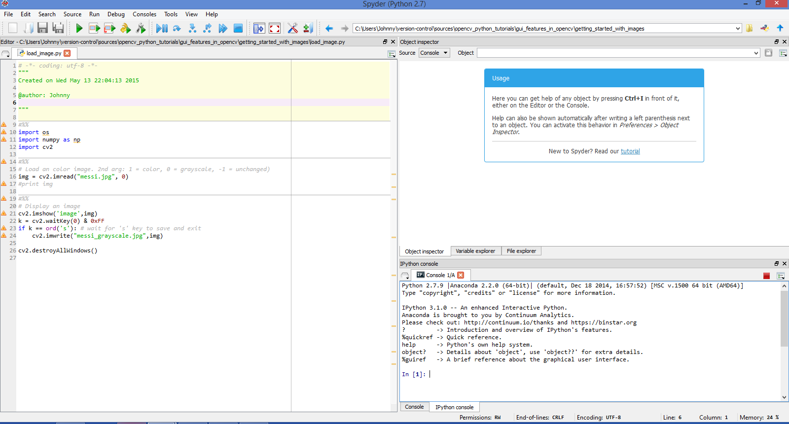
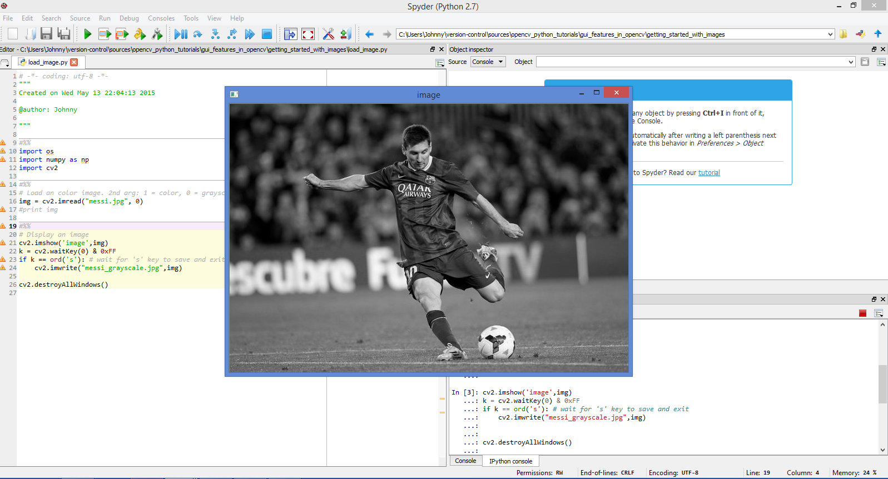

# Getting Started with Images

## How to test program

Open the code in Spyder IDE:

- Start the Spyder IDE.
- Open the file `load_image.py`.
- Update the current working directory (to the location where the `load_image.py` is stored.

Run the code in Spyder IDE:

Close the image preview window:

- Hover the mouse over the image preview window.
- Click on any buttons to close the image preview window. (Or click "s" to save as "messi_grayscale.jpg").

Try out other images if we like!

## References

See this [OpenCV-Python Tutorial Page - Getting Started with Images](http://opencv-python-tutroals.readthedocs.org/en/latest/py_tutorials/py_gui/py_image_display/py_image_display.html#display-image) for the official OpenCV-Python Tutorial Instructions.

The image [messi.jpg](messi_hd.jpg) (High Definition version) is obtained from [http://www.biznews.com/wp-content/uploads/2014/04/Barcelona.jpg](http://www.biznews.com/wp-content/uploads/2014/04/Barcelona.jpg).

# cv2.imshow (BGR) versus matplotlib.pyplot (RGB)

Inspired by a Python code by user "Abid Rahman Kat" at [this Stackoverflow forum](http://stackoverflow.com/questions/15072736/extracting-a-region-from-an-image-using-slicing-in-python-opencv/15074748#15074748), the code `show_image_cv2_vs_matplotlib.py` demonstrates the difference between plotting with cv2 versus matplotlib.

Simply running the code will reveal the difference between cv2.imshow (default uses BGR) versus matplotlib.pyplot (default uses RGB):

|-------------------------------------------------|
| Module      | BGR             |  RGB            |
|-------------|-----------------|-----------------|
| cv2         | true color      | distorted color | 
| matplotlib  | distorted color | true color      | 
|-------------------------------------------------|
