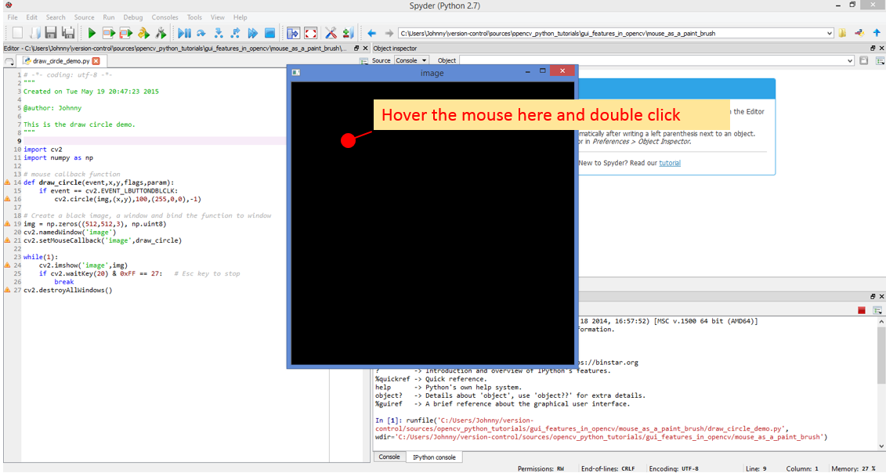
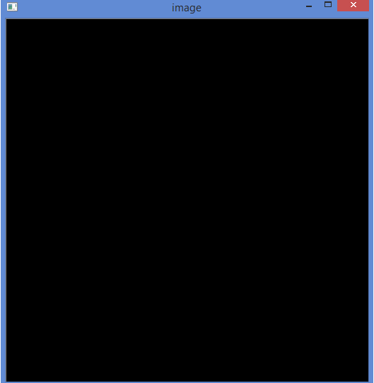
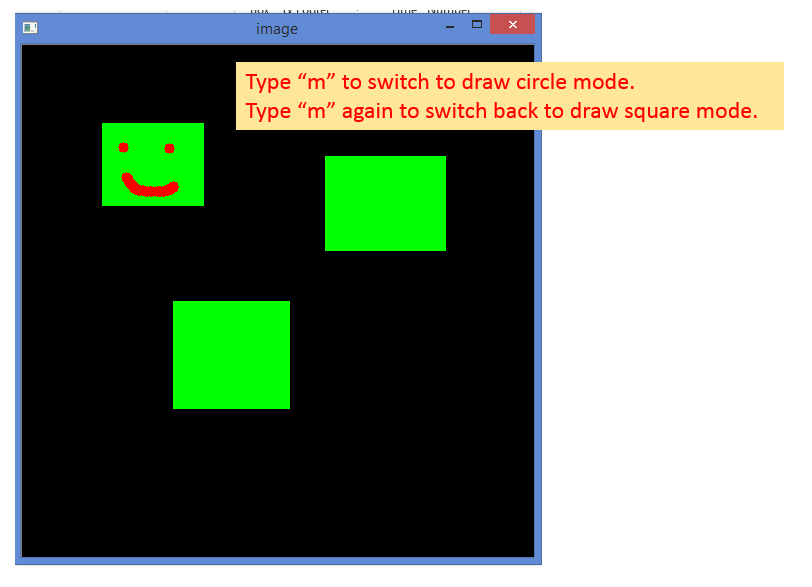

# Mouse as a Paint Brush

This the original official tutorial [at this OpenCV-Python Tutorial Page - Mouse as a Paint Brush](https://opencv-python-tutroals.readthedocs.org/en/latest/py_tutorials/py_gui/py_mouse_handling/py_mouse_handling.html#simple-demo).

# Check what mouse events are available

Run the code `print_available_events.py` will print out the list of available list of events to choose from. In this case, the output is:

```
['EVENT_FLAG_ALTKEY', 'EVENT_FLAG_CTRLKEY', 'EVENT_FLAG_LBUTTON', 'EVENT_FLAG_MBUTTON', 'EVENT_FLAG_RBUTTON', 'EVENT_FLAG_SHIFTKEY', 'EVENT_LBUTTONDBLCLK', 'EVENT_LBUTTONDOWN', 'EVENT_LBUTTONUP', 'EVENT_MBUTTONDBLCLK', 'EVENT_MBUTTONDOWN', 'EVENT_MBUTTONUP', 'EVENT_MOUSEHWHEEL', 'EVENT_MOUSEMOVE', 'EVENT_MOUSEWHEEL', 'EVENT_RBUTTONDBLCLK', 'EVENT_RBUTTONDOWN', 'EVENT_RBUTTONUP']
```

# Draw Circle Demo

This demo is pretty cool. Run the code `draw_circle_demo.py`.

It opens up a square black canvas (window). Hover over any point on the canvas. If you do a double click on the mouse, it draws out a blue circle.

Double click the mouse at different points will draw circles at those points.

Hit the `Esc` button to exit.




# Advanced Demo

An even cooler demo. Run the code `run_advanced_demo.py`.

It opens up a square black canvas (window). Hover over any point on the canvas. 

Hold down mouse and draw to create square shapes.

Type "m" (on keyboard) to switch to draw circle mode. Hold down mouse and move round canvas to draw.

Type "m" (on keyboard) to switch back to draw square mode.

Hit the `Esc` button to exit.






# Conclusions

Here we have run a few demos relating to using the mouse and keyboard to draw circles and squares. This concept will aid our understanding in later concepts such as object tracking and image segmentation.
