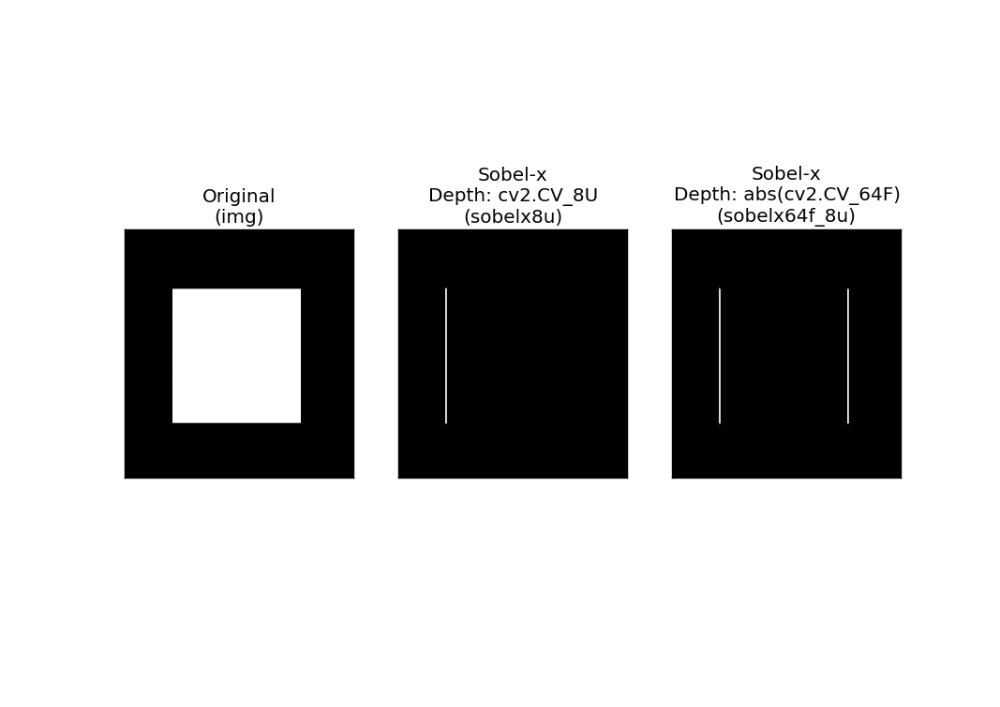
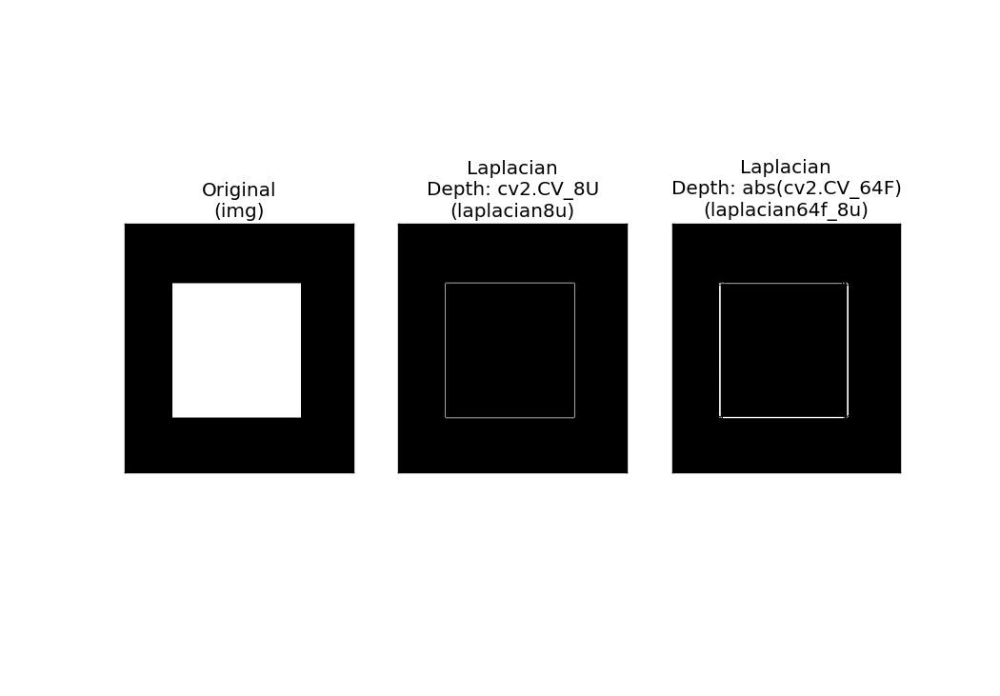
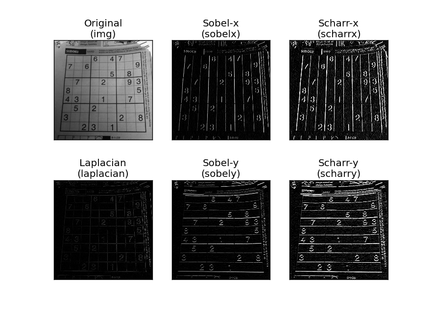
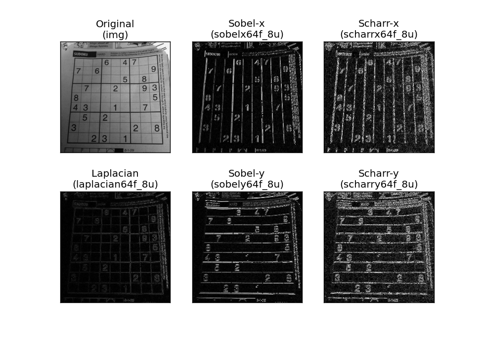

# Image Gradients

See [OpenCV-Python - Image Gradients](https://opencv-python-tutroals.readthedocs.org/en/latest/py_tutorials/py_imgproc/py_gradients/py_gradients.html#gradients) for the original tutorials.

# Compare depths: 8U vs 64F

## Sobel-x - 8U vs 64F

The full code: `compare_depths_8u_vs_64f_sobel_x.py`

```python
import cv2
import numpy as np
from matplotlib import pyplot as plt

img = cv2.imread('box.png',0)

# Output dtype = cv2.CV_8U
sobelx8u = cv2.Sobel(img, cv2.CV_8U, 1, 0, ksize=3)
# Output dtype = cv2.CV_64F. Then take its absolute and convert to cv2.CV_8U
sobelx64f = cv2.Sobel(img, cv2.CV_64F, 1, 0, ksize=3)
abs_sobelx64f = np.absolute(sobelx64f)
sobelx64f_8u = np.uint8(abs_sobelx64f)
```



Note: 

- at depth 8U: slope is detected ok when go from black to white (positive slope). When going from white to black, the slope is negative and floored to zero - i.e. no edge is detected in that case.
- at depth 64F, take the absolte figure and convert back to 8U, the above problem goes away. i.e. negative slope is also picked up.

## Laplacian - 8U vs 64F

The full code: `compare_depths_8u_vs_64f_laplacian.py`

```python
import cv2
import numpy as np
from matplotlib import pyplot as plt

img = cv2.imread('box.png',0)

# Output dtype = cv2.CV_8U
laplacian8u = cv2.Laplacian(img, cv2.CV_8U)
# Output dtype = cv2.CV_64F. Then take its absolute and convert to cv2.CV_8U
laplacian64f = cv2.Laplacian(img, cv2.CV_64F)
abs_laplacian64f = np.absolute(laplacian64f)
laplacian64f_8u = np.uint8(abs_laplacian64f)
```

Notes:

- looks like the Laplacian method is unaffected by the negative slope issue (as mentioned in the sobel test previously). i.e. be the depth 8U or 64F, all edges are detected ok.



# Compare Methods at Depth 8U 

The full code: `compare_methods_at_depth_8u.py`

```python
import cv2
from matplotlib import pyplot as plt

img = cv2.imread('davemark_sudoku.jpg', 0)

laplacian = cv2.Laplacian(img, cv2.CV_8U)
sobelx = cv2.Sobel(img, cv2.CV_8U, 1, 0, ksize=3)
sobely = cv2.Sobel(img, cv2.CV_8U, 0, 1, ksize=3)
scharrx = cv2.Sobel(img, cv2.CV_8U, 1, 0, ksize=-1)
scharry = cv2.Sobel(img, cv2.CV_8U, 0, 1, ksize=-1)
```



Notes:

- for the Sobel / Scharr methods, the negative slopes are not picked up (from white to black). Only the slopes from black to white are picked up. Reason for this is explained previously under the section "Sobel-x - 8U vs 64F" (which also apply to Sobel in the y direction as well). For instance, the number "1" in the sudoku appears only as a line (the right edge that goes from black to white).
- Laplacian method seems ok. e.g. the letter 1 is displayed ok.

# Compare Methods at Depth 64F

The full code: `compare_methods_at_depth_64f.py`

```python
import cv2
import numpy as np
from matplotlib import pyplot as plt

img = cv2.imread('davemark_sudoku.jpg',0)

# Detect slopes in x and y directions with cv2.Laplacian with depth cv2.CV_64F and convert back to cv2.CV_8U
laplacian64f = cv2.Laplacian(img,cv2.CV_64F)
abs_laplacian64f = np.absolute(laplacian64f)
laplacian64f_8u = np.uint8(abs_laplacian64f)

# Detect slopes in x direction with cv2.Sobel with depth cv2.CV_64F and convert back to cv2.CV_8U
sobelx64f = cv2.Sobel(img,cv2.CV_64F,1,0,ksize=3)
abs_sobelx64f = np.absolute(sobelx64f)
sobelx64f_8u = np.uint8(abs_sobelx64f)

# Detect slopes in y direction with cv2.Sobel with depth cv2.CV_64F and convert back to cv2.CV_8U
sobely64f = cv2.Sobel(img,cv2.CV_64F,0,1,ksize=3)
abs_sobely64f = np.absolute(sobely64f)
sobely64f_8u = np.uint8(abs_sobely64f)

# Detect slopes in x direction with cv2.Scharr with depth cv2.CV_64F and convert back to cv2.CV_8U
scharrx64f = cv2.Sobel(img,cv2.CV_64F,1,0,ksize=-1)
abs_scharrx64f = np.absolute(scharrx64f)
scharrlx64f_8u = np.uint8(abs_scharrx64f)

# Detect slopes in y direction with cv2.Scharr with depth cv2.CV_64F and convert back to cv2.CV_8U
scharry64f = cv2.Sobel(img,cv2.CV_64F,0,1,ksize=-1)
abs_scharry64f = np.absolute(scharry64f)
scharry64f_8u = np.uint8(abs_scharry64f)
```



Notes:

- Both positive and negative slopes are now picked up. For instance, the number "1" in the sudoku appears as a line (the left edge that goes from white to black - the negative slope) plus another line (the right edge that goes from black to white - the positive slope).
- Laplacian method seems ok. e.g. the letter 1 is displayed ok.

# Conclusion

The example we have used correspond to 3-by-3 kernels. For Apple-to-apple comparison purposes.

When choosing depths, tt might be wise to use depth 64F, take absolute value, and convert back to 8U (rather than just taking depth 8U straight away). This will increase the chance that all edges are captured (regardless of positive or negative slopes). This might not matter as much for the laplacian method.

- Sobel x detects slope is the x direction.
- Sobel y detects slope is the y direction.
- Laplacian detects slope in both x and y directions.
- the Scharr method is essentially a more accurate version of Sobel, with ksize of -1 (i.e. 3-by-3 kernel)
