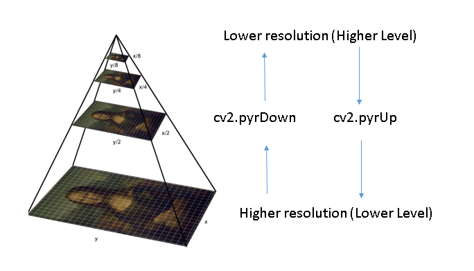

# Image Pyramids

See [OpenCV-Python Tutorials - Image Pyramids] for the original tutorials.

Image Pyramid as a picture:



# cv2.pyrDown and cv2.pyrUp

See the [official OpenCV documentation on cv2.pyrDown and cv2.pyrUp](http://docs.opencv.org/modules/imgproc/doc/filtering.html) for more info.

- `cv2.pyrDown`: Blurs an image and downsamples (half the size) it.
- `cv2.pyrUp`: Upsamples (double the size) an image and then blurs it.

## Demo with Grayscale Image

This demo code `pyramid.py` illustrate the use of `cv2.pyrDown` and `cv2.pyrUp`.

Illustration:

1. Starting with an original image
2. pyrDown 1st time to blur and downsample it.
3. pyrDown 2nd time to blur and downsample it.
4. pyrDown 3rd time to blur and downsample it.
5. pyrUp 1st time to upsample an image and then blur it.
6. pyrUp 2st time to upsample an image and then blur it.
7. pyrUp 3st time to upsample an image and then blur it.
8. The resulting image become the same size as the original, but blurred (due to all the lost of pixels during the blurring processes).

Output:


## Demo with Edged Image

This demo code `pyramid_edged_image.py` essentially is the same as the above `pyramid.py`. I merely replace the original grayscale image with an edged image, created using the Cunny Edge Detector, as mentioned in [the OpenCV-Python Tutorials - Cunny Edge Detection](https://opencv-python-tutroals.readthedocs.org/en/latest/py_tutorials/py_imgproc/py_canny/py_canny.html#canny) chapter.

i.e. this one line is inserted to the code:

```.python
edges = cv2.Canny(img, 100, 200)
```

(and we replace the original image with this one)

This is the output:


