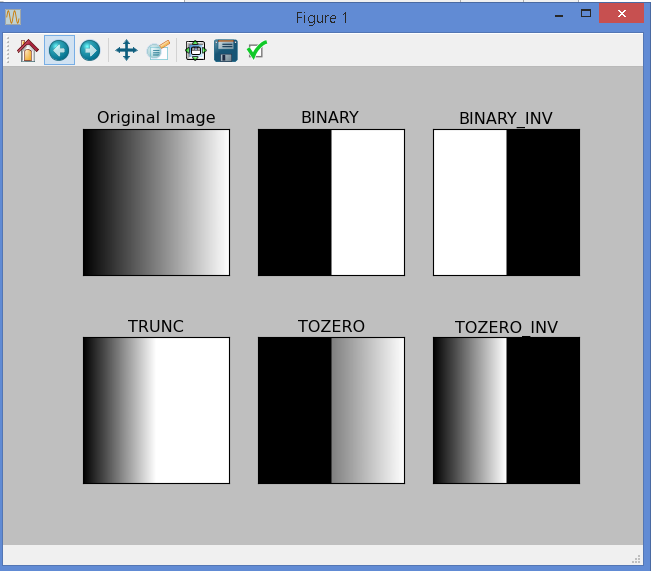
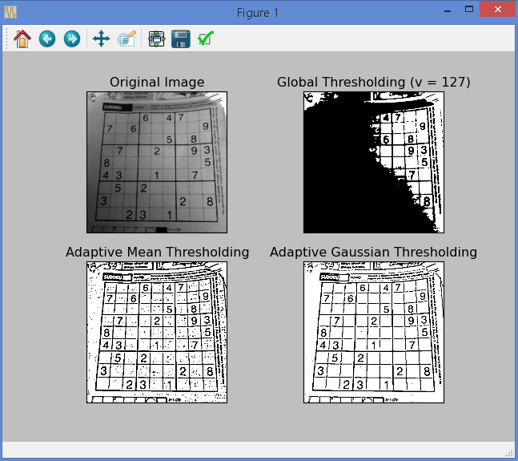
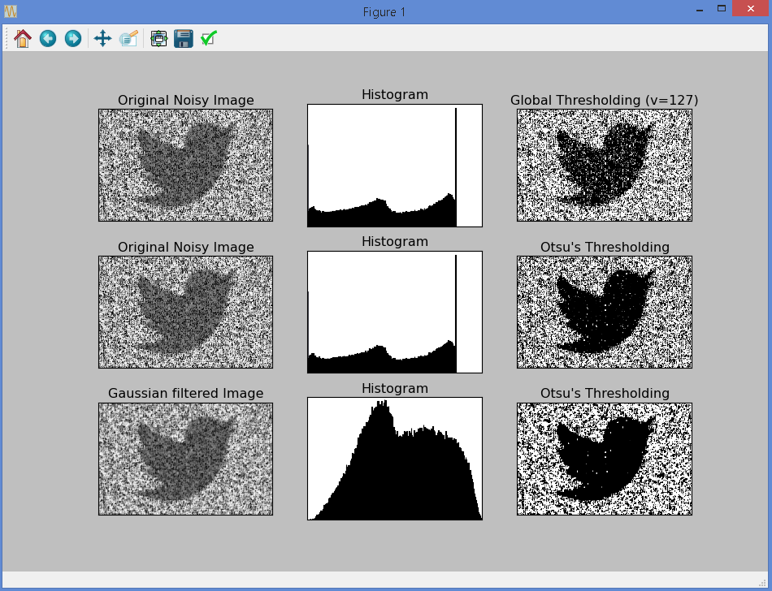

# Image Thresholding

See [OpenCV-Python Tutorials - Image Thresholding](https://opencv-python-tutroals.readthedocs.org/en/latest/py_tutorials/py_imgproc/py_thresholding/py_thresholding.html#thresholding) for the original tutorials.

# Create a Simple Gradient Image

It turns out that the sample tutorial requires us to have a gradient image that looks like this:

So I have created this code `create_gradient_png.py` that will automaticaly create this image (enter "s" whilst the image is displayed will save it as `gradient.png` in the same directory - which I have already done.)

# Sample Thresholding

Code: `demo_image_thresholding.py`

Screenshots:

# Adaptive Thresholding

Code: `sudoku_image_adaptive_thresholding.png`

Screenshots:

Note: I obtain the input image `davemark_sudoku.jpg` from [this blog post by Dave Mark](http://www.davemark.com/?p=1164) - via a simple Google image search.

# Otsu Binarization

Code: `demo_otsu_binarization.py`

Screenshots:

Note: I obtain the input image `davemark_sudoku.jpg` from [this psmag.com blog post](http://www.psmag.com/nature-and-technology/whispering-town-square-can-twitter-provide-escape-noise-90493) - via a simple Google image search.

# Conclusion

Here we have successfully executed some demos on image thresholdings.